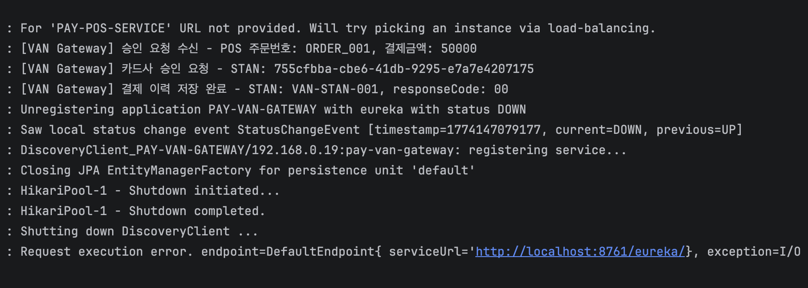
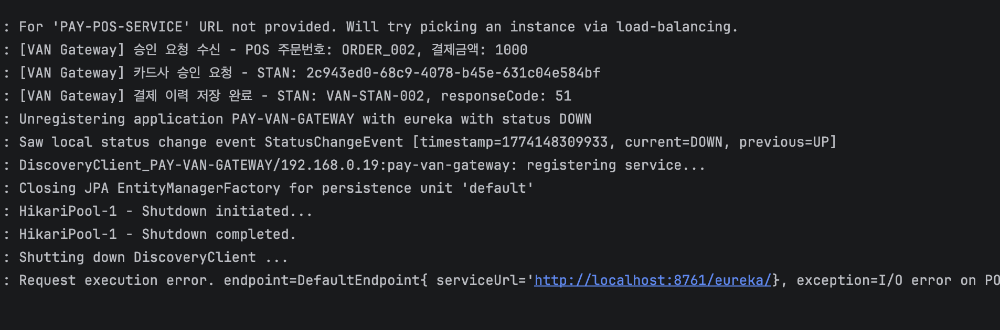
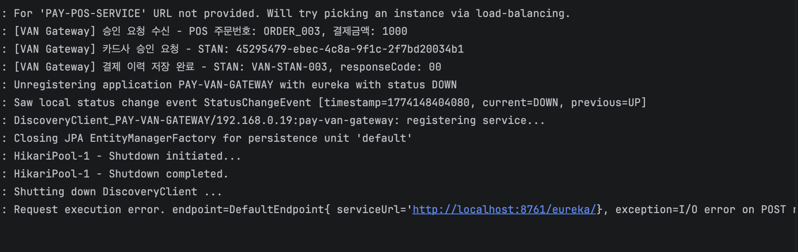

# 박주호 : 가맹점(POS)와 VAN서버 담당
가맹점(POS)과 카드사로부터 받은 결제 승인 요청을 중계하고 표준 전문 규격 데이터를 처리하여 결제 이력을 관리하는 **VAN(Value Added Network) 게이트웨이** 역할을 담당

---

## 프로젝트 개요 및 역할
전체 카드결제 시스템 아키텍처 내에서 **가맹점(POS)과 카드사 서버를 연결하는 인터페이스**를 담당
* **POS 접점**: 가맹점(POS)에서 들어오는 결제 요청을 수신하는 API 설계
* **중계 로직**: 가맹점 요청 데이터를 카드사 요청 형태로 변환
* **이력 관리**: 결제 성공/실패 여부를 DB에 기록하여 정산 및 추적성 확보

---

## 기술적 특징: Java Record 도입 (데이터 무결성 확보)
DTO(Data Transfer Object) 설계 시 Class 대신 **Java Record**를 활용

### 1. 데이터 불변성(Immutability) 보장
* **이유**: 카드번호, 유효기간, 단말기ID, 거래금액 등의 결제 정보는 생성 후 프로세스 완료 시까지 변하지 않아야 하는 기록
    * Record를 통해 모든 필드를 `private final`로 선언하여 생성 후 값 변조를 통해 결제 로직 수행 중 발생할 수 있는 데이터 오염 방지

### 2. 코드 간결성 및 의도 명확화
* Boilerplate 코드를 제거하여 데이터 전달이라는 본연의 목적에 집중하고 해당 객체(DTO/PosPaymentRequest, DTO/PosPaymentResponse)가 '읽기 전용'임을 명확히 전달

---

## 시스템 아키텍처 및 흐름

가맹점(POS) -> [ **VAN Gateway ** ] -> 카드사

1. **승인 요청**: POS로부터 `PosPaymentRequest` 수신
2. **데이터 변환**: 카드번호 기반으로 카드사를 식별하고 카드사 요청 객체로 변환
3. **외부 연동**: OpenFeign을 통해 카드사 서버로 승인 요청 전달
4. **결과 영속화**: 카드사 응답을 기반으로 `PaymentHistory` 엔티티에 DB 저장
5. **결과 응답**: 최종 승인 결과를 `PosPaymentResponse`(Record) 형태로 POS에 반환

---

## 주요 구현 내용

### 1. API 디자인 (Controller)
Swagger를 활용하여 상세한 명세를 제공하며, 가맹점의 승인 요청을 받는 엔트리 포인트입니다.
- `POST /api/v1/approval/request`: 카드 승인 요청 처리

### 2. 비즈니스 로직 (Service)
- **카드사 식별 로직**: 카드번호 패턴을 분석하여 VISA, MASTERCARD, WOORICARD 등을 구분
- **트랜잭션 관리**: 카드사 승인 결과 수신과 DB 기록 과정을 하나의 트랜잭션(`@Transactional`)으로 묶어 데이터 유실 방지
- **로깅**: 결제 흐름 추적을 위해 주문 번호(POS)와 승인 번호(STAN)를 포함한 로그 기록

---

## Test Code
### 1. VISA 카드 결제 승인 성공 시 응답 데이터 매핑 및 DB 저장이 정상적으로 수행되는지 검증

### 2. 잔액 부족(51)으로 승인 실패 시 카드사 응답 코드와 메시지가 POS로 정상 전달되는지 검증

### 3. 미정의 카드번호 '1' 입력 시 카드사가 UNKNOWN으로 식별되는지 검증

